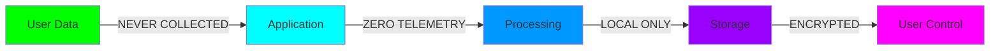

<div align="center">

```ascii
╔══════════════════════════════════════════════════════════════════════════════╗
║                                                                                            ║
║   ████████╗███████╗ ██████╗██╗  ██╗███╗   ██╗ ██████╗                              ║
║   ╚══██╔══╝██╔════╝██╔════╝██║  ██║████╗  ██║██╔═══██╗                            ║
║      ██║   █████╗  ██║      ███████║██╔██╗ ██║██║   ██║                              ║
║      ██║   ██╔══╝  ██║      ██╔══██║██║╚██╗██║██║   ██║                              ║
║      ██║   ███████╗╚██████╗██║  ██║██║ ╚████║╚██████╔╝                             ║
║      ╚═╝   ╚══════╝ ╚═════╝╚═╝  ╚═╝╚═╝  ╚═══╝ ╚═════╝                               ║
║                                                                                            ║
║              ██████╗ ██╗██╗   ██╗██╗███╗   ██╗███████╗                               ║
║              ██╔══██╗██║██║   ██║██║████╗  ██║██╔════╝                               ║
║              ██║  ██║██║██║   ██║██║██╔██╗ ██║█████╗                                 ║
║              ██║  ██║██║╚██╗ ██╔╝██║██║╚██╗██║██╔══╝                                 ║
║              ██████╔╝██║ ╚████╔╝ ██║██║ ╚████║███████╗                              ║
║              ╚═════╝ ╚═╝  ╚═══╝  ╚═╝╚═╝  ╚═══╝╚══════╝                               ║
║                                                                                            ║
║                         S O L U T I O N S                                                  ║
║                                                                                            ║
╚══════════════════════════════════════════════════════════════════════════════╝
```


[](https://opensource.org/licenses/MIT)
[]()
[]()
[]()

</div>

---

## 🎯 MISSION DIRECTIVE

> **We don't protect your data. We simply don't collect it.**

Techno Divine Solutions is an elite development collective engineering the next generation of **White Paper Applications** — software that respects your digital sovereignty and operates in complete privacy darkness.

<table>
<tr>
<td width="50%">

### 🛡️ **Core Principles**

```python
class TechnoDivine:
    def __init__(self):
        self.tracking = None
        self.analytics = None
        self.telemetry = None
        self.data_mining = None
        
    def collect_user_data(self):
        return "ACCESS_DENIED"
    
    def respect_privacy(self):
        return "ALWAYS"
```

</td>
<td width="50%">

### ⚡ **Technical Stack**

```kotlin
// Privacy-Optimized Architecture
- Android: Kotlin | Java
- Backend: Zero-Knowledge Systems
- Storage: Local-First | E2E Encrypted
- Network: Minimal | Anonymous
- Logging: /dev/null
```

</td>
</tr>
</table>

---

## 🔬 RESEARCH & DEVELOPMENT LAB

<div align="center">

### **Currently in Active Development**

| Project | Domain | Status | Privacy Level |
|---------|--------|--------|---------------|
| **Cloak** | Encrypted UI Navigation | `[████████░░] 80%` | 🔴 MAXIMUM |
| **Phantom Sync** | Zero-Footprint Data Sync | `[██████░░░░] 60%` | 🔴 MAXIMUM |
| **Ghost Protocol** | Anonymous Communication | `[███████░░░] 70%` | 🔴 MAXIMUM |
| **Cipher Suite** | Encryption Utilities | `[█████░░░░░] 50%` | 🔴 MAXIMUM |
| **Void Cache** | Secure Local Storage | `[██████████] 90%` | 🔴 MAXIMUM |
| **Shadow Net** | Privacy-First Networking | `[████░░░░░░] 40%` | 🔴 MAXIMUM |
| **Stealth Mode** | Digital Footprint Eraser | `[███░░░░░░░] 30%` | 🔴 MAXIMUM |
| **Obsidian Guard** | Security Framework | `[█████████░] 85%` | 🔴 MAXIMUM |

</div>

---

## 💎 THE WHITE PAPER PHILOSOPHY

<div align="center">



</div>

### **What Makes Us Different**

| Traditional Apps | Techno Divine Apps |
|------------------|-------------------|
| ❌ Collect everything | ✅ Collect nothing |
| ❌ Track user behavior | ✅ Blind to user actions |
| ❌ Third-party analytics | ✅ Zero external dependencies |
| ❌ Cloud-first storage | ✅ Local-first architecture |
| ❌ Monetize your data | ✅ Your data stays yours |
| ❌ Complex privacy policies | ✅ Simple: We see nothing |

---

## 🏗️ ARCHITECTURE BLUEPRINT

<div align="center">

```
┌─────────────────────────────────────────────────────────────┐
│                    APPLICATION LAYER                                   │
│  ┌──────────┐  ┌──────────┐  ┌──────────┐  ┌──────────┐       │
│  │   UI/UX    │  │  Logic     │  │ Security   │  │  Crypto    │        │
│  └────┬─────┘  └────┬─────┘  └────┬─────┘  └────┬─────┘       │
└───────┼─────────────┼─────────────┼─────────────┼─────────┘
        │             │             │             │
┌───────┼─────────────┼─────────────┼─────────────┼─────────┐
│      │             │             │             │         │
│  ┌────▼─────┐ ┌────▼─────┐  ┌────▼─────┐ ┌────▼─────┐     │
│  │ No Track   │  │ No Cloud   │  │ No Logs    │  │ No Leak    │     │
│  └──────────┘  └──────────┘  └──────────┘  └──────────┘     │
│                    PRIVACY BARRIER LAYER                             │
└───────────────────────────────────────────────────────────┘
                           │
                    ┌──────▼──────┐
                    │  LOCAL ONLY    │
                    │   STORAGE      │
                    └─────────────┘
```

</div>

---

## 📡 TECH STACK RADAR

<div align="center">

### **Core Technologies**


### **Privacy Tools**


</div>

---

## 🎖️ DEVELOPMENT METRICS

<div align="center">


</div>

---

## 🔐 SECURITY COMMITMENT

<div align="center">

| Security Measure | Implementation Status |
|------------------|----------------------|
| End-to-End Encryption | ✅ **ACTIVE** |
| Zero-Knowledge Architecture | ✅ **ACTIVE** |
| Local-First Data Storage | ✅ **ACTIVE** |
| No External Dependencies | ✅ **ACTIVE** |
| Open Source Cryptography | ✅ **ACTIVE** |
| Regular Security Audits | ✅ **ACTIVE** |
| No Backdoors Policy | ✅ **GUARANTEED** |

</div>

---

## 🚀 JOIN THE MOVEMENT

<div align="center">

### **Closed Beta Testing Program**

We're selectively onboarding privacy advocates and developers for our flagship applications.

```bash
# To apply for beta access
git clone privacy@techno-divine.dev
cd applications
./request_access.sh --project=[PROJECT_NAME]
```

[]()
[]()
[]()

</div>

---

## 💬 PHILOSOPHY

<div align="center">

> *"Privacy is not an option, and it shouldn't be the price we pay for just getting on the internet."*  
> **— Gary Kovacs**

> *"We don't protect your data. We architect systems that never see it in the first place."*  
> **— Techno Divine Solutions**

</div>

---

## 📜 LICENSE & TERMS

<div align="center">

```
MIT License | Privacy-First | No Tracking | No Telemetry | No Compromise

Copyright © 2024 Techno Divine Solutions
Building the future, respecting the past, protecting your present.
```

[]()
[]()

---


</div>
